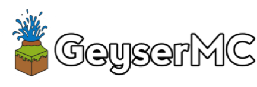

Geyser is a bridge between Minecraft: Bedrock Edition and Minecraft: Java Edition, closing the gap from those wanting to play true cross-platform.

Geyser is an open collaboration project by CubeCraft Games.

## What is Geyser?
Geyser is a proxy, bridging the gap between Minecraft: Bedrock Edition and Minecraft: Java Edition servers.
The ultimate goal of this project is to allow Minecraft: Bedrock Edition users to join Minecraft: Java Edition servers as seamlessly as possible. **Please note, this project is still a work in progress and should not be used on production. Expect bugs!**

Special thanks to the DragonProxy project for being a trailblazer in protocol translation and for all the team members who have now joined us here!

!!! note
    Currently supporting Minecraft Bedrock v1.14.6(0) and Minecraft Java v1.15.2.

## Setting Up
Take a look [here](https://github.com/GeyserMC/Geyser/wiki#Setup) for how to set up Geyser.

## Links:
- Website: https://geysermc.org
- Docs: https://github.com/GeyserMC/Geyser/wiki
- Download: http://ci.geysermc.org
- Discord: http://discord.geysermc.org/
- Donate: https://patreon.com/GeyserMC

## Libraries Used:
- [NukkitX Bedrock Protocol Library](https://github.com/NukkitX/Protocol)
- [Steveice10's Java Protocol Library](https://github.com/Steveice10/MCProtocolLib)
- [TerminalConsoleAppender](https://github.com/Minecrell/TerminalConsoleAppender)
- [Simple Logging Facade for Java (slf4j)](https://github.com/qos-ch/slf4j)
